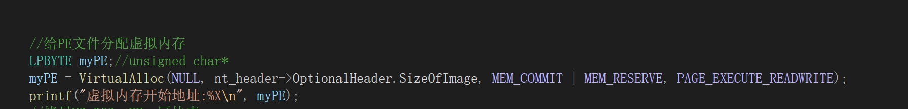
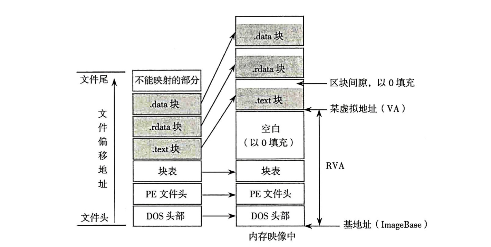
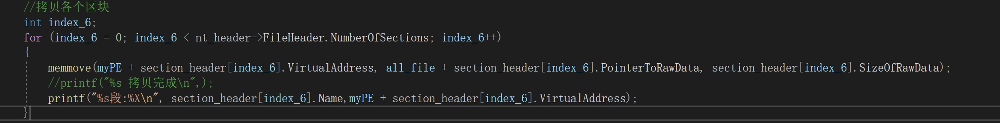
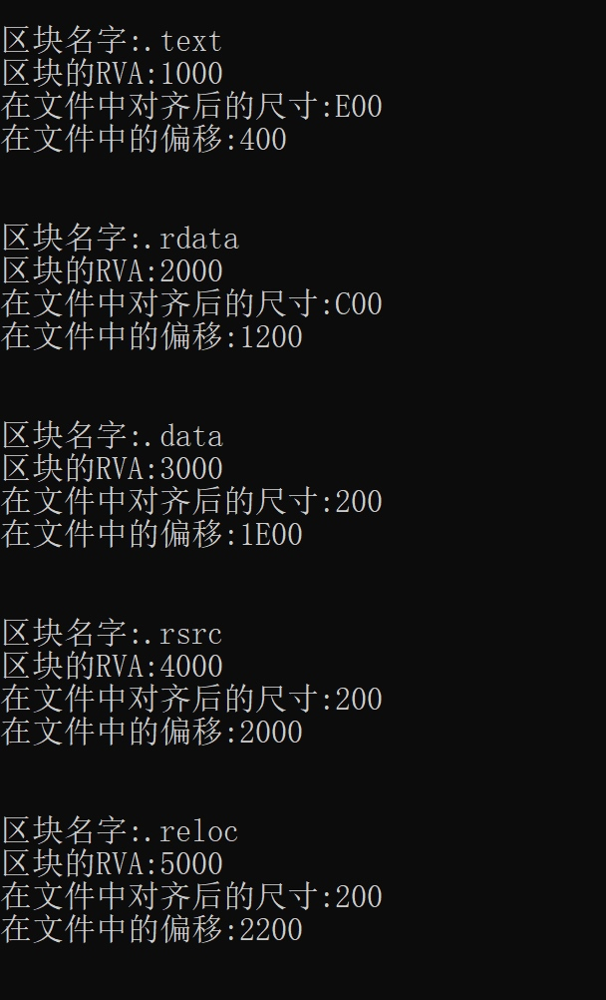
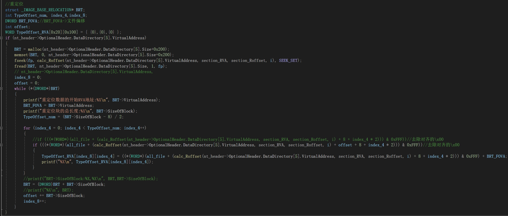
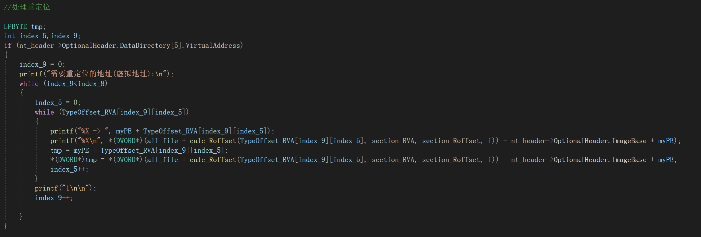
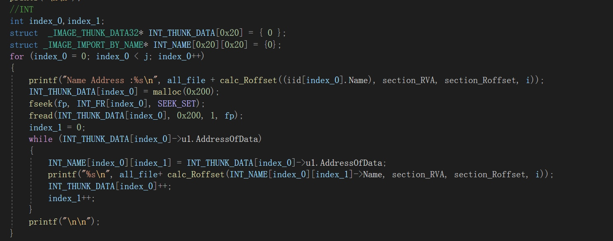
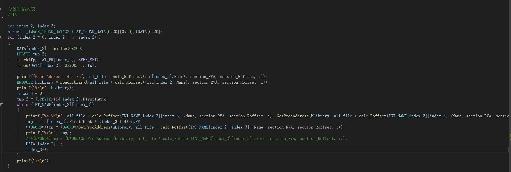
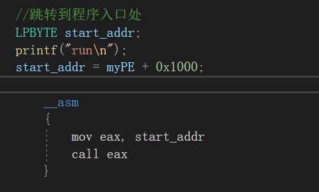

# PE文件加载过程
### 一、 申请PE虚拟地址空间
通过`IMAGE_OPTIONAL_HEADER`结构体中的`sizeofimage`成员的大小，调用`VirtualAlloc`函数来进行分配虚拟空间



### 二、 拷贝各个区块


DOS、PE文件头、区块表直接拷贝，无偏移，从`SizeOfHeaders`中获取大小

接下来对各个区块进行拷贝，这里注意要按照区块表的虚拟相对偏移来进行拷贝


具体数值可以在区块表中进行查看:



### 三、 重定位

公式: **重定位后的地址=需要重定位的地址-默认加载基址(0x400000)+当前加载基址**

根据数据目录表中第六个成员来找到重定位数据的相关信息

以下是找出需要重定位的RVA


> 循环检测是否存在多页重定位

然后对内存中所需要修改的地址进行修改覆盖


### 四、 处理输入地址表(`IAT`)

1. 获取程序中需要加载的`dll`文件，调用`LoadLibraryA`函数把该`dll`文件映射到内存中
2. 获取输入名称表`INT`中函数的名字，调用`GetProcAddress`获取函数在内存中的真实地址
3. 对内存中的输入地址表`IAT`进行修改覆盖


以下是获取`INT`


以下是对内存中的`IAT`进行修改覆盖



### 五、跳转到OEP




### 六、完整代码

```c
#define _CRT_SECURE_NO_WARNINGS
#include <windows.h>
#include<stdio.h>
#define AUTHOR cmFkaXNoZXMudG9w

IMAGE_DOS_HEADER* dos_header;
IMAGE_NT_HEADERS* nt_header;
IMAGE_SECTION_HEADER* section_header;
IMAGE_IMPORT_DESCRIPTOR* iid;
int section_RVA[0x20];
int section_Roffset[0x20];
int calc_Roffset(int RVA,int arr_RVA[],int arr_FO[],int length)
{
	int i,file_offset;
	for (i = length-1;i>-1;i--)
	{
		if (RVA >= arr_RVA[i])
		{
			file_offset = RVA - arr_RVA[i] + arr_FO[i];
			//printf("############:%X\n", file_offset);
			return file_offset;
		}
	}
	return 0;
}

int main()
{
	FILE* fp;
	dos_header = malloc(sizeof(IMAGE_DOS_HEADER));
	//打开文件 
	fp = fopen("C:\\Users\\radish\\Desktop\\test5.exe", "rb");
	//fp = fopen("C:\\win-tools\\xdbg\\release\\x32\\x32dbg.exe", "rb");
	fseek(fp, 0, SEEK_END);

	long length = ftell(fp);
	rewind(fp);
	printf("%ld\n", length);
	char* all_file;
	all_file = malloc(length);
	fread(all_file, length, 1, fp);

	fseek(fp, 0, SEEK_SET);
	//判断文件格式是否为PE文件 
	fread(dos_header, sizeof(IMAGE_DOS_HEADER), 1, fp);
	if (dos_header->e_magic != IMAGE_DOS_SIGNATURE)
	{
		printf("This is a wrong format!,errno=0x0\n");
		exit(0);
	}
	nt_header = malloc(sizeof(IMAGE_NT_HEADERS));
	//	printf("%d",sizeof(IMAGE_NT_HEADERS));//0xf8
		//printf("%d",fp);
	fseek(fp, dos_header->e_lfanew, SEEK_SET);//调整文件指针 
	fread(nt_header, sizeof(IMAGE_NT_HEADERS), 1, fp);
	if (nt_header->Signature != IMAGE_NT_SIGNATURE)
	{
		printf("This is a wrong format!,errno=0x1\n");
		exit(0);
	}
	else {
		printf("this is a PE file\n");
		printf("\n\n");
	}

	//显示PE文件头信息 
	printf("NT->Signature:%X", nt_header->Signature);
	printf("运行平台:%x\n", nt_header->FileHeader.Machine);
	printf("文件的区块数:%X\n", nt_header->FileHeader.NumberOfSections);
	printf("文件创建时间:%X\n", nt_header->FileHeader.TimeDateStamp);
	printf("IMAGE_OPTIONAL_HEADER32结构的大小:%X\n", nt_header->FileHeader.SizeOfOptionalHeader);
	printf("\n\n");

	//IMAGE_OPTIONAL_HEADER32详细信息
	printf("映像载入内存后的总尺寸:%X\n", nt_header->OptionalHeader.SizeOfImage);
	printf("MS-DOS、PE、区块表总大小:%X\n", nt_header->OptionalHeader.SizeOfHeaders);
	printf("所有含有代码的区块的大小:%X\n", nt_header->OptionalHeader.SizeOfCode);
	printf("所有初始化数据区块的大小:%X\n", nt_header->OptionalHeader.SizeOfInitializedData);
	printf("所有未初始化数据区块的大小:%X\n", nt_header->OptionalHeader.SizeOfUninitializedData);
	printf("程序执行入口RVA:%X\n", nt_header->OptionalHeader.AddressOfEntryPoint);
	printf("代码区块起始地址RVA:%X\n", nt_header->OptionalHeader.BaseOfCode);
	printf("数据区块起始地址RVA:%X\n", nt_header->OptionalHeader.BaseOfData);
	printf("程序默认载入基地址:%X\n", nt_header->OptionalHeader.ImageBase);
	printf("内存中区块的对齐值:%X\n", nt_header->OptionalHeader.SectionAlignment);
	printf("文件中区块的对齐值:%X\n", nt_header->OptionalHeader.FileAlignment);
	printf("数据目录表的项数:%X\n", nt_header->OptionalHeader.NumberOfRvaAndSizes);
	printf("\n\n");


	//数据目录表 
	printf("导出表地址:%X\n", nt_header->OptionalHeader.DataDirectory[0].VirtualAddress);
	printf("导入表地址:%X,大小:%X\n", nt_header->OptionalHeader.DataDirectory[1].VirtualAddress, nt_header->OptionalHeader.DataDirectory[1].Size);
	printf("重定位:%X,大小:%X\n", nt_header->OptionalHeader.DataDirectory[5].VirtualAddress, nt_header->OptionalHeader.DataDirectory[5].Size);
	printf("TLS地址:%X,大小:%X\n", nt_header->OptionalHeader.DataDirectory[9].VirtualAddress, nt_header->OptionalHeader.DataDirectory[9].Size);
	printf("导入地址表:%x,大小:%X\n", nt_header->OptionalHeader.DataDirectory[12].VirtualAddress, nt_header->OptionalHeader.DataDirectory[12].Size);
	printf("\n\n");
	//sections
	fseek(fp, sizeof(IMAGE_NT_HEADERS) + (dos_header->e_lfanew), SEEK_SET);
	section_header = malloc(sizeof(IMAGE_SECTION_HEADER) * nt_header->FileHeader.NumberOfSections);
	fread(section_header, sizeof(IMAGE_SECTION_HEADER) * nt_header->FileHeader.NumberOfSections, 1, fp);
	int i;
	for (i = 0; i < nt_header->FileHeader.NumberOfSections; i++)
	{
		printf("区块名字:%s\n", section_header[i].Name);
		printf("区块的RVA:%X\n", section_header[i].VirtualAddress);
		printf("在文件中对齐后的尺寸:%X\n", section_header[i].SizeOfRawData);
		printf("在文件中的偏移:%X\n", section_header[i].PointerToRawData);
		section_RVA[i] = section_header[i].VirtualAddress;
		section_Roffset[i] = section_header[i].PointerToRawData;
		printf("\n\n");
	}
	//	for(j=0;j<i;j++)
	//	{
	//		printf("%x  ",section_RVA[j]);
	//	}
		

		//导入表
		int IID_Roffset;
		IID_Roffset =  calc_Roffset(nt_header->OptionalHeader.DataDirectory[1].VirtualAddress, section_RVA, section_Roffset, i);

		//printf("%X", IID_Roffset);
		
		fseek(fp,IID_Roffset,SEEK_SET);
		iid = malloc(0x200);
		fread(iid,0x200,1,fp);
		int j=0,INT_FR[0x20],IAT_FR[0x20];
		while(iid[j].Name)
		{
			printf("Name Address :%s\n",all_file+ calc_Roffset((iid[j].Name), section_RVA, section_Roffset, i));
			INT_FR[j] = calc_Roffset(iid[j].OriginalFirstThunk, section_RVA, section_Roffset, i);
			IAT_FR[j] = calc_Roffset(iid[j].FirstThunk, section_RVA, section_Roffset, i);
			printf("INT RVA:%X,文件偏移:%X\n", iid[j].OriginalFirstThunk, INT_FR[j]);
			printf("IAT RVA:%X,文件偏移:%X\n", iid[j].FirstThunk, IAT_FR[j]);
			j++;
		}
		printf("\n\n");
		//INT
		int index_0,index_1;
		struct  _IMAGE_THUNK_DATA32* INT_THUNK_DATA[0x20] = { 0 };
		struct _IMAGE_IMPORT_BY_NAME* INT_NAME[0x20][0x20] = {0};
		for (index_0 = 0; index_0 < j; index_0++)
		{
			printf("Name Address :%s\n", all_file + calc_Roffset((iid[index_0].Name), section_RVA, section_Roffset, i));
			INT_THUNK_DATA[index_0] = malloc(0x200);
			fseek(fp, INT_FR[index_0], SEEK_SET);
			fread(INT_THUNK_DATA[index_0], 0x200, 1, fp);
			index_1 = 0;
			while (INT_THUNK_DATA[index_0]->u1.AddressOfData)
			{
				INT_NAME[index_0][index_1] = INT_THUNK_DATA[index_0]->u1.AddressOfData;
				printf("%s\n", all_file+ calc_Roffset(INT_NAME[index_0][index_1]->Name, section_RVA, section_Roffset, i));
				INT_THUNK_DATA[index_0]++;
				index_1++;
			}
			printf("\n\n");
		}
		
		//重定位
		struct _IMAGE_BASE_RELOCATION* BRT;
		int TypeOffset_num, index_4,index_8;
		DWORD BRT_FOVA;//BRT_FOVA->文件偏移
		int offset;
		WORD TypeOffset_RVA[0x20][0x100] = { {0},{0},{0} };
		if (nt_header->OptionalHeader.DataDirectory[5].VirtualAddress)
		{
			BRT = malloc(nt_header->OptionalHeader.DataDirectory[5].Size+0x200);
			memset(BRT, 0, nt_header->OptionalHeader.DataDirectory[5].Size+0x200);
			fseek(fp, calc_Roffset(nt_header->OptionalHeader.DataDirectory[5].VirtualAddress, section_RVA, section_Roffset, i), SEEK_SET);
			fread(BRT, nt_header->OptionalHeader.DataDirectory[5].Size, 1, fp);
			// nt_header->OptionalHeader.DataDirectory[5].VirtualAddress, 
			index_8 = 0;
			offset = 0;
			while (*(DWORD*)BRT)
			{
				printf("重定位数据的开始RVA地址:%X\n", BRT->VirtualAddress);
				BRT_FOVA = BRT->VirtualAddress;
				printf("重定位块的总长度:%X\n", BRT->SizeOfBlock);
				TypeOffset_num = (BRT->SizeOfBlock - 8) / 2;

				for (index_4 = 0; index_4 < TypeOffset_num; index_4++)
				{
					//if (((*(WORD*)(all_file + (calc_Roffset(nt_header->OptionalHeader.DataDirectory[5].VirtualAddress, section_RVA, section_Roffset, i) + 8 + index_4 * 2))) & 0xFFF))//去除对齐的\x00
					if (((*(WORD*)(all_file + (calc_Roffset(nt_header->OptionalHeader.DataDirectory[5].VirtualAddress, section_RVA, section_Roffset, i) + offset + 8 + index_4 * 2))) & 0xFFF))//去除对齐的\x00
					{
						TypeOffset_RVA[index_8][index_4] = ((*(WORD*)(all_file + (calc_Roffset(nt_header->OptionalHeader.DataDirectory[5].VirtualAddress, section_RVA, section_Roffset, i) + 8 + index_4 * 2))) & 0xFFF) + BRT_FOVA;
						printf("%X\n", TypeOffset_RVA[index_8][index_4]);
					}
				}
				//printf("BRT->SizeOfBlock:%X,%X\n", BRT,BRT->SizeOfBlock);
				BRT = (DWORD)BRT + BRT->SizeOfBlock;
				//printf("%X\n", BRT);
				offset += BRT->SizeOfBlock;
				index_8++;
			}
		}
		
		
		
		//给PE文件分配虚拟内存
		LPBYTE myPE;//unsigned char*
		myPE = VirtualAlloc(NULL, nt_header->OptionalHeader.SizeOfImage, MEM_COMMIT | MEM_RESERVE, PAGE_EXECUTE_READWRITE);
		printf("虚拟内存开始地址:%X\n", myPE);
		//拷贝MS-DOS、PE、区块表
		memmove(myPE, all_file, nt_header->OptionalHeader.SizeOfHeaders);
		//printf("%X,%X\n", myPE, all_file);

		//拷贝各个区块
		int index_6;
		for (index_6 = 0; index_6 < nt_header->FileHeader.NumberOfSections; index_6++)
		{
			memmove(myPE + section_header[index_6].VirtualAddress, all_file + section_header[index_6].PointerToRawData, section_header[index_6].SizeOfRawData);
			//printf("%s 拷贝完成\n",);
			printf("%s段:%X\n", section_header[index_6].Name,myPE + section_header[index_6].VirtualAddress);
		}

		printf("\n\n");
		
		//处理重定位
		
		LPBYTE tmp;
		int index_5,index_9;
		if (nt_header->OptionalHeader.DataDirectory[5].VirtualAddress)
		{
			index_9 = 0;
			printf("需要重定位的地址(虚拟地址):\n");
			while (index_9<index_8)
			{
				index_5 = 0;
				while (TypeOffset_RVA[index_9][index_5])
				{
					printf("%X -> ", myPE + TypeOffset_RVA[index_9][index_5]);
					printf("%X\n", *(DWORD*)(all_file + calc_Roffset(TypeOffset_RVA[index_9][index_5], section_RVA, section_Roffset, i)) - nt_header->OptionalHeader.ImageBase + myPE);
					tmp = myPE + TypeOffset_RVA[index_9][index_5];
					*(DWORD*)tmp = *(DWORD*)(all_file + calc_Roffset(TypeOffset_RVA[index_9][index_5], section_RVA, section_Roffset, i)) - nt_header->OptionalHeader.ImageBase + myPE;
					index_5++;
				}
				printf("1\n\n");
				index_9++;
				
			}
		}
		


		//处理输入表
		//IAT
		
		int index_2, index_3;
		struct  _IMAGE_THUNK_DATA32 *IAT_THUNK_DATA[0x20][0x20],*DATA[0x20];
		for (index_2 = 0; index_2 < j; index_2++)
		{
			DATA[index_2] = malloc(0x200);
			LPBYTE tmp_2;
			fseek(fp, IAT_FR[index_2], SEEK_SET);
			fread(DATA[index_2], 0x200, 1, fp);

			printf("Name Address :%s  \n", all_file + calc_Roffset((iid[index_2].Name), section_RVA, section_Roffset, i));
			HMODULE hLibrary = LoadLibraryA(all_file + calc_Roffset((iid[index_2].Name), section_RVA, section_Roffset, i));
			printf("%X\n", hLibrary);
			index_3 = 0;
			tmp_2 = (LPBYTE)iid[index_2].FirstThunk;
			while (INT_NAME[index_2][index_3])
			{
				printf("%s:%X\n", all_file + calc_Roffset(INT_NAME[index_2][index_3]->Name, section_RVA, section_Roffset, i), GetProcAddress(hLibrary, all_file + calc_Roffset(INT_NAME[index_2][index_3]->Name, section_RVA, section_Roffset, i)));
				tmp = iid[index_2].FirstThunk + (index_3 * 4)+myPE;
				*(DWORD*)tmp = (DWORD*)GetProcAddress(hLibrary, all_file + calc_Roffset(INT_NAME[index_2][index_3]->Name, section_RVA, section_Roffset, i));
				printf("%x\n", tmp);
				//*(DWORD*)tmp = (DWORD)GetProcAddress(hLibrary, all_file + calc_Roffset(INT_NAME[index_2][index_3]->Name, section_RVA, section_Roffset, i));
				DATA[index_2]++;
				index_3++;
			}
			printf("\n\n");
		}
		
		//跳转到程序入口处
		LPBYTE start_addr;
		printf("run\n");
		start_addr = myPE + 0x1000;

			__asm
			{
				mov eax, start_addr
				call eax
			}

		printf("down!");
		return 0;
}
```


### 问题
1. 第五步，`nt_header->OptionalHeader.AddressOfEntryPoint`作为OEP的时候，还是会出现某些地址没有重定位的错误
