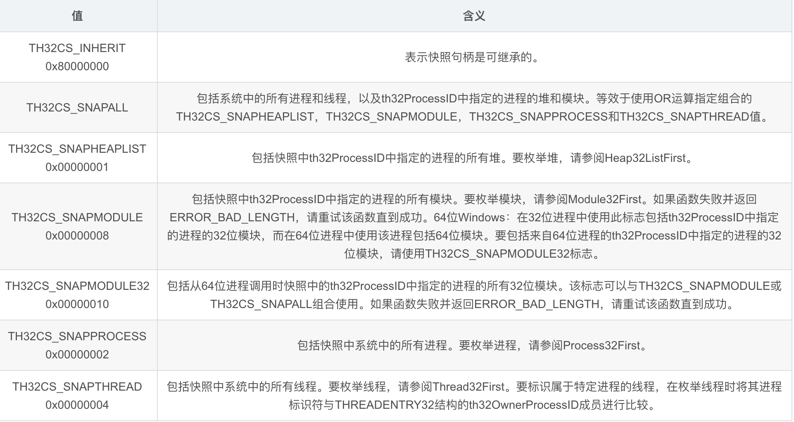
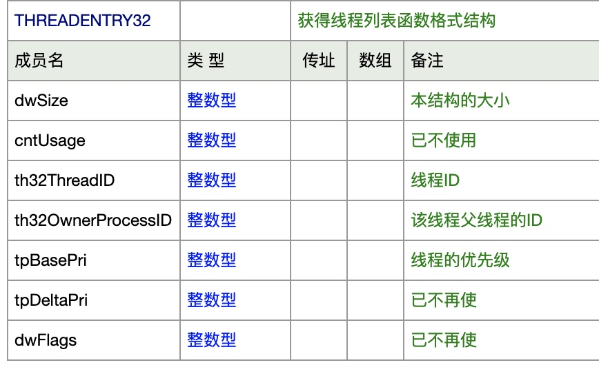
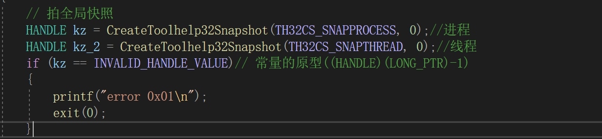
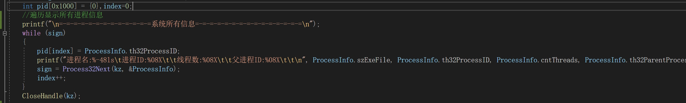
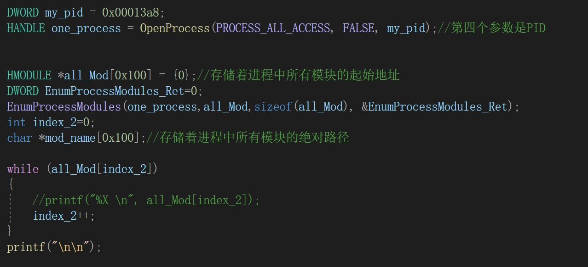
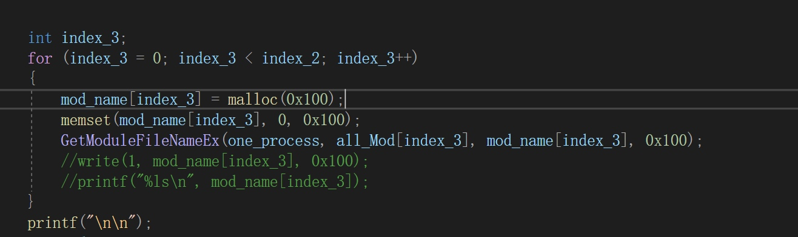
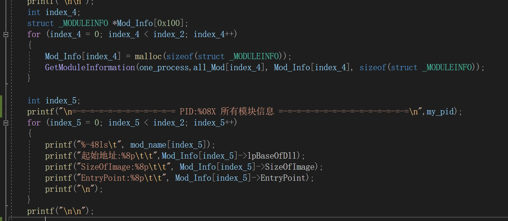
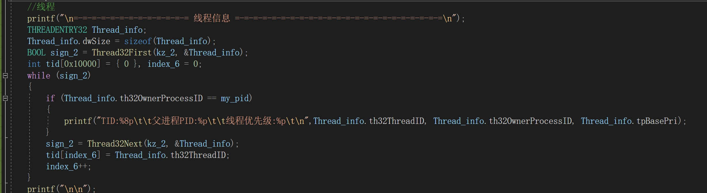
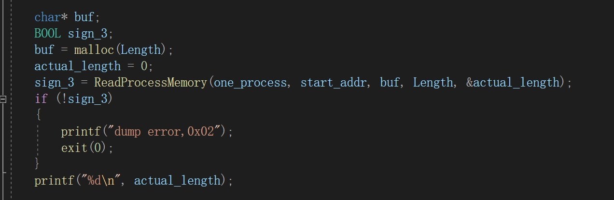

# PEdump

## 一、Windows API
### CreateToolhelp32Snapshot
该函数可以通过获取进程信息为指定的进程、进程使用的堆块、模块、线程建立一个快照


```c
/****** Shapshot function **********************************************/

HANDLE
WINAPI
CreateToolhelp32Snapshot(
    DWORD dwFlags,//指明快照需要返回的对象
    DWORD th32ProcessID
    //用来指定要获取哪一个进程的快照，当获取系统进程列表或获取当前进程快照时可以设为0
    );
```
参数一:


参数二:
指定将要快照的进程`ID`。如果该参数为0表示快照当前进程。该参数只有在设置了`TH32CS_SNAPHEAPLIST`或者`TH32CS_SNAPMODULE`后才有效，在其他情况下该参数被忽略，所有的进程都会被快照
### PROCESSENTRY32
用来存放快照进程信息的一个结构体
```c
/***** Process walking *************************************************/

typedef struct tagPROCESSENTRY32W
{
    DWORD   dwSize;//初始化一个实例以后调用Process32First函数，设置成员的大小sizeof (PROCESSENTRY32)
    DWORD   cntUsage;
    DWORD   th32ProcessID;          // this process's PID
    ULONG_PTR th32DefaultHeapID;
    DWORD   th32ModuleID;           // associated exe
    DWORD   cntThreads;         //线程数
    DWORD   th32ParentProcessID;    // this process's parent process 父进程
    LONG    pcPriClassBase;         // Base priority of process's threads线程优先级
    DWORD   dwFlags;
    WCHAR   szExeFile[MAX_PATH];    // Path
} PROCESSENTRY32W;
```
### Process32First
`process32First`是一个进程获取函数，当我们利用函数`CreateToolhelp32Snapshot()`获得当前运行进程的快照后，我们可以利用`process32First`函数来获得第一个进程的句柄


```c
BOOL
WINAPI
Process32FirstW(
    HANDLE hSnapshot,//快照句柄
    LPPROCESSENTRY32W lppe//存放进程信息的结构体地址
    );
```
### Process32Next
当我们利用函数CreateToolhelp32Snapshot()获得当前运行进程的快照后,我们可以利用Process32Next函数来获得下一个进程的句柄。
```c
BOOL
WINAPI
Process32NextW(
    HANDLE hSnapshot,//快照句柄
    LPPROCESSENTRY32W lppe//存放进程信息的结构体地址
    );
```
### OpenProcess
该函数用来打开一个已存在的进程对象，并返回进程的句柄

```c
WINBASEAPI
HANDLE
WINAPI
OpenProcess(
    _In_ DWORD dwDesiredAccess,//访问权限（PROCESS_ALL_ACCESS是所有权限）
    _In_ BOOL bInheritHandle,//是否继承句柄
    _In_ DWORD dwProcessId//PID
    );
```
### ReadProcessMemory
该函数可根据进程句柄读入该进程的某个内存空间

```c
BOOL
WINAPI
ReadProcessMemory(
    _In_ HANDLE hProcess,//进程句柄，openprocess或者createprocess
    _In_ LPCVOID lpBaseAddress,//读取地址， 从具体何处读取
    _Out_writes_bytes_to_(nSize,*lpNumberOfBytesRead) LPVOID lpBuffer,//函数将读取的内容写入此处
    _In_ SIZE_T nSize,//要拷贝的字节数
    _Out_opt_ SIZE_T* lpNumberOfBytesRead//返回实际拷贝的字节数
    );
```
### EnumProcessModules
获取一个进程的所有模块（`DLL`、`Thread`）

```c
BOOL
WINAPI
EnumProcessModules(
    _In_ HANDLE hProcess,
    _Out_writes_bytes_(cb) HMODULE* lphModule,
    _In_ DWORD cb,
    _Out_ LPDWORD lpcbNeeded
    );
```
### GetModuleFileNameEx
获取模块的绝对路径

```c
DWORD
WINAPI
GetModuleFileNameExW(
    _In_opt_ HANDLE hProcess,//openprocess
    _In_opt_ HMODULE hModule,//EnumProcessModules
    _When_(return < nSize, _Out_writes_to_(nSize, return + 1))
    _When_(return == nSize, _Out_writes_all_(nSize))
         LPWSTR lpFilename,
    _In_ DWORD nSize
    );
```
### GetModuleInformation
获取模块的详细信息

```c
BOOL
WINAPI
GetModuleInformation(
    _In_ HANDLE hProcess,
    _In_ HMODULE hModule,
    _Out_ LPMODULEINFO lpmodinfo,
    _In_ DWORD cb
    );
```

### THREADENTRY32


## 过程
### 建立快照
快照分进程和线程


### 遍历系统所有进程信息


### 获取某进程中的所有模块的信息（起始地址）


### 获取某进程模块的名字
基于模块的起始地址

### 获取某进程模块的详细信息
基于模块的起始地址


### 获取某进程的线程信息


### Dump
利用`ReadProcessMemory`来对内存进行`Dump`




## 完整程序

```c
#define _CRT_SECURE_NO_WARNINGS
#include <stdio.h>  
#include <Windows.h>  
#include <TlHelp32.h>  
#include <Psapi.h>
#include <time.h>
#include <string.h>
#define AUTHOR cmFkaXNoZXMudG9w

SIZE_T read_num()
{
    char buf[0x20];
    read(0,buf,0x20);
    return atoi(buf);
}

int main()
{
    // 拍全局快照
    HANDLE kz = CreateToolhelp32Snapshot(TH32CS_SNAPPROCESS, 0);//进程
    HANDLE kz_2 = CreateToolhelp32Snapshot(TH32CS_SNAPTHREAD, 0);//线程
    if (kz == INVALID_HANDLE_VALUE)// 常量的原型((HANDLE)(LONG_PTR)-1)
    {
        printf("error 0x01\n");
        exit(0);
    }
    //创建存放进程信息的结构体
    PROCESSENTRY32 ProcessInfo;
    ProcessInfo.dwSize = sizeof(ProcessInfo);
    BOOL sign = Process32First(kz, &ProcessInfo);
    int pid[0x1000] = {0},index=0;
    //遍历显示所有进程信息
    printf("\n=-=-=-=-=-=-=-=-=-=-=-=-=系统所有信息=-=-=-=-=-=-=-=-=-=-=-=-=-=-=\n");
    while (sign)
    {
        pid[index] = ProcessInfo.th32ProcessID;
        printf("进程名:%-48ls\t进程ID:%08X\t\t线程数:%08X\t\t父进程ID:%08X\t\t\n", ProcessInfo.szExeFile, ProcessInfo.th32ProcessID, ProcessInfo.cntThreads, ProcessInfo.th32ParentProcessID);
        sign = Process32Next(kz, &ProcessInfo);
        index++;
    }
    CloseHandle(kz);


    DWORD my_pid = 0x00013a8;
    HANDLE one_process = OpenProcess(PROCESS_ALL_ACCESS, FALSE, my_pid);//第四个参数是PID

   
    HMODULE *all_Mod[0x100] = {0};//存储着进程中所有模块的起始地址
    DWORD EnumProcessModules_Ret=0;
    EnumProcessModules(one_process,all_Mod,sizeof(all_Mod), &EnumProcessModules_Ret);
    int index_2=0;
    char *mod_name[0x100];//存储着进程中所有模块的绝对路径
   
    while (all_Mod[index_2])
    {
        //printf("%X \n", all_Mod[index_2]);
        index_2++;
    }
    printf("\n\n");

    
    int index_3;
    for (index_3 = 0; index_3 < index_2; index_3++)
    {
        mod_name[index_3] = malloc(0x100);
        memset(mod_name[index_3], 0, 0x100);
        GetModuleFileNameEx(one_process, all_Mod[index_3], mod_name[index_3], 0x100);
        //write(1, mod_name[index_3], 0x100);
        //printf("%ls\n", mod_name[index_3]);
    }
    printf("\n\n");
    int index_4;
    struct _MODULEINFO *Mod_Info[0x100];
    for (index_4 = 0; index_4 < index_2; index_4++)
    {
        Mod_Info[index_4] = malloc(sizeof(struct _MODULEINFO));
        GetModuleInformation(one_process,all_Mod[index_4], Mod_Info[index_4], sizeof(struct _MODULEINFO));
    }
    
    int index_5;
    printf("\n=-=-=-=-=-=-=-=-=-=-=-= PID:%08X 所有模块信息 =-=-=-=-=-=-=-=-=-=-=-=-=-=-=\n",my_pid);
    for (index_5 = 0; index_5 < index_2; index_5++)
    {   
        printf("%-48ls\t", mod_name[index_5]);
        printf("起始地址:%8p\t\t",Mod_Info[index_5]->lpBaseOfDll);
        printf("SizeOfImage:%8p\t\t", Mod_Info[index_5]->SizeOfImage);
        printf("EntryPoint:%8p\t\t", Mod_Info[index_5]->EntryPoint);
        printf("\n");
    }
    printf("\n\n");
        
    //线程
    printf("\n=-=-=-=-=-=-=-=-=-=-=-=-= 线程信息 =-=-=-=-=-=-=-=-=-=-=-=-=-=-=-=-=-=-=-=-=-=-=\n");
    THREADENTRY32 Thread_info;
    Thread_info.dwSize = sizeof(Thread_info);
    BOOL sign_2 = Thread32First(kz_2, &Thread_info);
    int tid[0x10000] = { 0 }, index_6 = 0;
    while (sign_2)
    {
        if (Thread_info.th32OwnerProcessID == my_pid)
        {
            printf("TID:%8p\t\t父进程PID:%p\t\t线程优先级:%p\t\n",Thread_info.th32ThreadID, Thread_info.th32OwnerProcessID, Thread_info.tpBasePri);
        }
        sign_2 = Thread32Next(kz_2, &Thread_info);
        tid[index_6] = Thread_info.th32ThreadID;
        index_6++;
    }
    printf("\n\n");

    printf("\n=-=-=-=-=-=-=-=-=-=-=-=-= Dump 内存信息 =-=-=-=-=-=-=-=-=-=-=-=-=-=-=-=-=-=-=-=-=-=-=\n");
    SIZE_T start_addr,Length,actual_length;
    //start_addr = read_num();
    printf("开始地址(Hex):");
    scanf("%x", &start_addr);
    printf("长度(Hex):");
    scanf("%x", &Length);
    if (start_addr < 0 || Length < 0)
    {
        printf("error,0x01");
        exit(0);
    }

    
    char* buf;
    BOOL sign_3;
    buf = malloc(Length);
    actual_length = 0;
    sign_3 = ReadProcessMemory(one_process, start_addr, buf, Length, &actual_length);
    if (!sign_3)
    {
        printf("dump error,0x02");
        exit(0);
    }
    printf("%d\n", actual_length);

    //生成文件名
    char* file_name=malloc(0x50);

    char* tmp = malloc(0x50);
    time_t current_time;
    current_time = time(NULL);

    sprintf(file_name, "Dump_%d.bin", current_time);
    //printf("%s", file_name);
    FILE *fp = fopen(file_name, "w+");
    if (!fp)
    {
        printf("error,0x03");
        exit(0);
    }
    fwrite(buf, actual_length,1,fp);
    printf("Done,save in %s!", file_name);
    return 0;
}
```


## 防止dump
- 在程序运行之后擦除PE头部和节表信息
- 把所有进程的`OpenProcess`这个API挂钩，企图打开本身程序的全部返回0
