# 干预输入表处理过程加载目标`dll`
## 静态修改PE
目标`dll`是`MsgDll.dll`
该`dll`中有一个输出函数`Msg`，`dllMain`函数中存在一个弹窗

要想程序自动载入我们自己的`dll`，就需要在`IID`数组中增加一个成员，也就是我们`MsgDll.dll`的信息
首先找到**原数据目录表**，如下所示
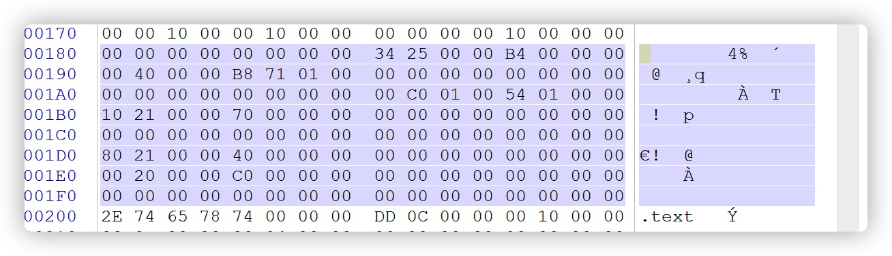
数据目录表的第二个成员是输入表，找到程序**原IID数组**
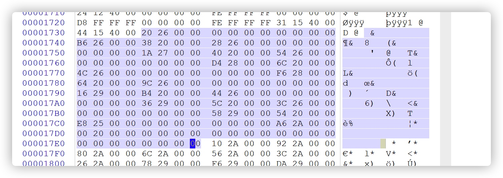

需要增加`20`字节的数据，原来`IID`数组的空间是放不下的，有两种办法解决
1. 每个段是对齐的，段结尾一般存在`\x00`填充，可以将`IID`数组填充在这里
2. 增加一个段，将新数据添加到这个段中（较为复杂）

如图所示，这是本段末尾的空闲区域
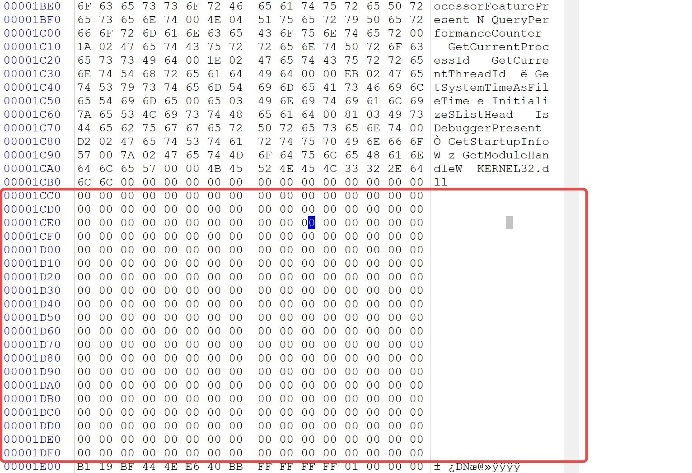

原来输入表的大小是`0xb4`，添加一个成员之后大小变为`0xc8`，这里足够放得下

颜色加深的是新添加的`IID`成员
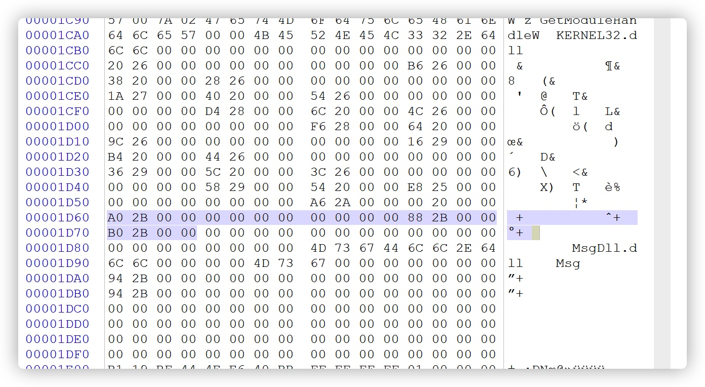

这里是`dll`的名字和输出函数的名字
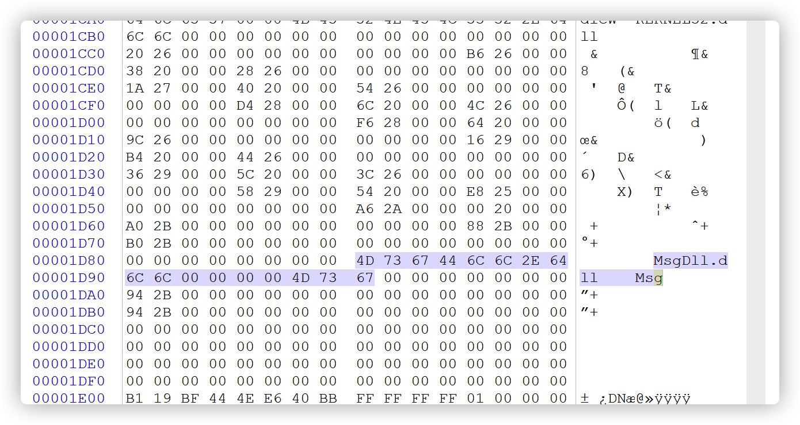

分别是`INT`和`IAT`
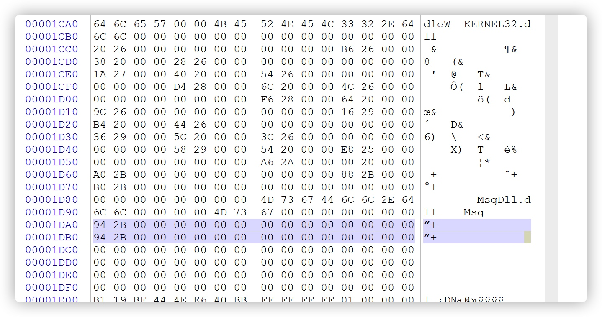

最后保存一下，用PEtools查看，可以看到解析成功
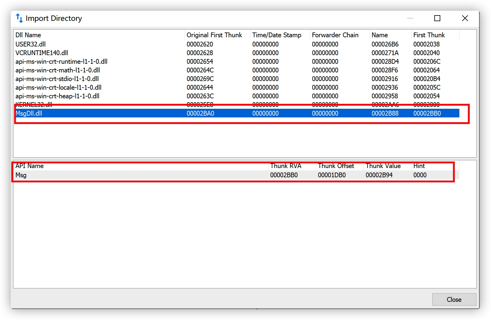

运行：
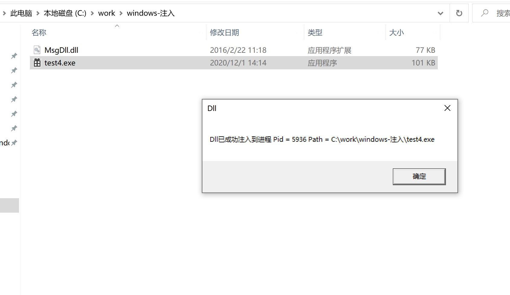


以下是地址转换
```
00002534,000000B4 -> 0x2ac0, 0xc8

dll名字字符串地址：0x2b88
Msg 名字地址：0x1d94-0x2b94
INT addr :0x1da0-0x2ba0
IAT addr :0x1db0-0x2bb0
```


## 进程创建期修改输入表
`CreateProcess`的参数`dwCreationFlags`为`CREATE_SUSPENDED`的时候，新进程的主线程会以暂停的状态被创建，直到调用ResumeThread函数被调用时才运行
```c
BOOL
WINAPI
CreateProcessW(
    _In_opt_ LPCWSTR lpApplicationName,
    _Inout_opt_ LPWSTR lpCommandLine,
    _In_opt_ LPSECURITY_ATTRIBUTES lpProcessAttributes,
    _In_opt_ LPSECURITY_ATTRIBUTES lpThreadAttributes,
    _In_ BOOL bInheritHandles,
    _In_ DWORD dwCreationFlags,
    _In_opt_ LPVOID lpEnvironment,
    _In_opt_ LPCWSTR lpCurrentDirectory,
    _In_ LPSTARTUPINFOW lpStartupInfo,
    _Out_ LPPROCESS_INFORMATION lpProcessInformation
    );
```
第一个参数指向要运行程序的绝对地址或者是相对地址
第二个参数指向命令行的参数
第九个参数指向一个用于决定新进程的主窗体如何显示的STARTUPINFO结构体
第十个参数指向一个用来接收新进程的识别信息的PROCESS_INFORMATION结构体

### `PROCESS_INFORMATION`
```c
typedef struct _PROCESS_INFORMATION {
    HANDLE hProcess;//返回新进程的句柄
    HANDLE hThread;//返回主线程的句柄
    DWORD dwProcessId;//返回一个全局进程标识符。该标识符用于标识一个进程。从进程被创建到终止，该值始终有效。
    DWORD dwThreadId;//返回一个全局线程标识符。该标识符用于标识一个线程。从线程被创建到终止，该值始终有效。
} PROCESS_INFORMATION, *PPROCESS_INFORMATION, *LPPROCESS_INFORMATION;
```

### ZwQueryInformationProcess

### VirtualAllocEx
函数的作用是在指定进程的虚拟空间保留或提交内存区域
```c
WINBASEAPI
_Ret_maybenull_
_Post_writable_byte_size_(dwSize)
LPVOID
WINAPI
VirtualAllocEx(
    _In_ HANDLE hProcess,
    _In_opt_ LPVOID lpAddress,
    _In_ SIZE_T dwSize,
    _In_ DWORD flAllocationType,
    _In_ DWORD flProtect
    );
```
### VirtualProtectEx
该函数用于修改进程中内存的保护方式

```c
WINBASEAPI
_Success_(return != FALSE)
BOOL
WINAPI
VirtualProtectEx(
    _In_ HANDLE hProcess,//createprocess
    _In_ LPVOID lpAddress,//起始地址
    _In_ SIZE_T dwSize,//长度（对齐）
    _In_ DWORD flNewProtect,//保护方式
    _Out_ PDWORD lpflOldProtect//用于保存原来的保护方式
    );
```

### WriteProcessMemory
用于修改内存中的数据

```c
BOOL
WINAPI
WriteProcessMemory(
    _In_ HANDLE hProcess,
    _In_ LPVOID lpBaseAddress,
    _In_reads_bytes_(nSize) LPCVOID lpBuffer,
    _In_ SIZE_T nSize,
    _Out_opt_ SIZE_T* lpNumberOfBytesWritten
    );
```


### 实现过程
首先使用`CreateProcess`以挂起方式打开
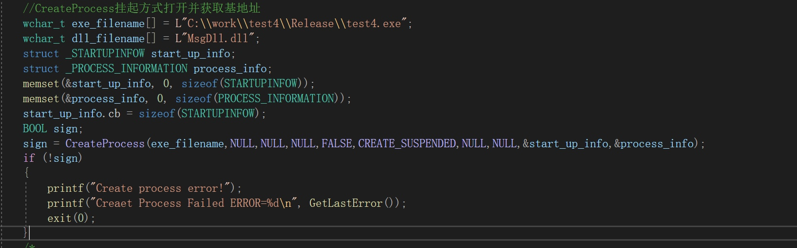
通过使用`NtQueryInformationProcess`函数获取到`peb`的数据，再通过`peb`结构找到基地址（`image_base`）
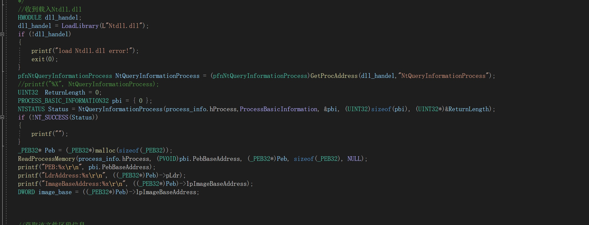

> 这个获取基地址的方法有点复杂，需要自定义结构体很多 :(
另一种获取基地址的方法:
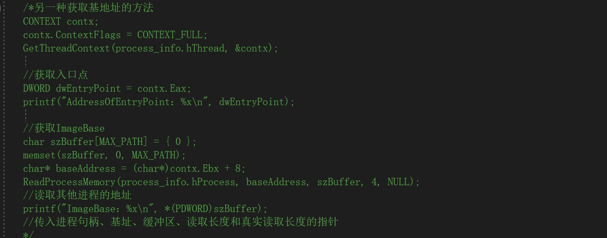

获取`exe`区块的信息，目的是为了找到输入表在内存中的哪里

利用`VirtualAllocEx`函数新申请一个段，目的是为了放我们伪造的输入表结构
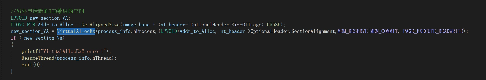

构造输入表结构并调用`WriteProcessMemory`函数写入内存

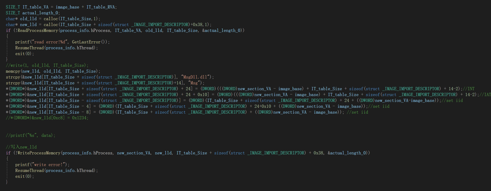

修改数据目录表中的输入表`RVA`和`SIZE`
> 这里需要注意要先把所在的段的属性修改成可写
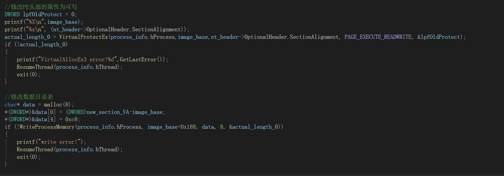

最后调用`ResumeThread`函数继续运行刚刚挂起的程序


效果：
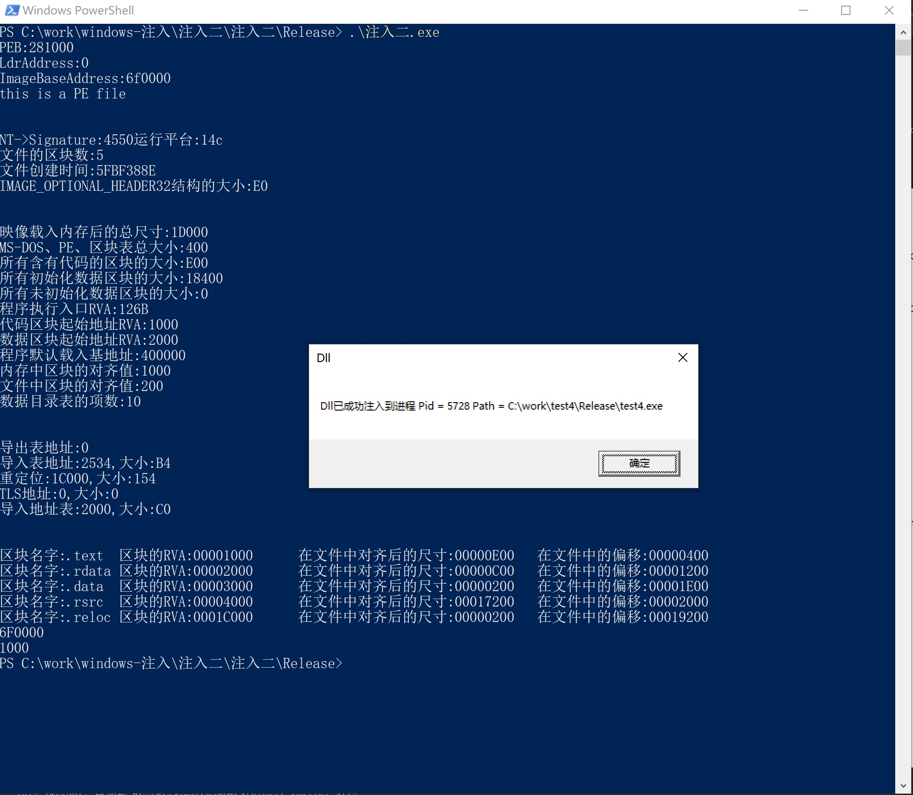

### 完整代码

```c
#define _CRT_SECURE_NO_WARNINGS
#include<stdio.h>
#include<Windows.h>
#include <Psapi.h>
#define AUTHOR cmFkaXNoZXMudG9w

#define ProcessBasicInformation 0
#define PAGE_EXECUTE_READWRITE 0x40

typedef
NTSTATUS(WINAPI* pfnNtQueryInformationProcess)
(HANDLE ProcessHandle, ULONG ProcessInformationClass,
	PVOID ProcessInformation, UINT32 ProcessInformationLength,
	UINT32* ReturnLength);

#define NT_SUCCESS(x) ((x) >= 0)

typedef struct _UNICODE_STR
{
	USHORT Length;
	USHORT MaximumLength;
	PWSTR pBuffer;
} UNICODE_STR, * PUNICODE_STR;

typedef struct _PEB_LDR_DATA //, 7 elements, 0x28 bytes
{
	DWORD dwLength;
	DWORD dwInitialized;
	LPVOID lpSsHandle;
	LIST_ENTRY InLoadOrderModuleList;
	LIST_ENTRY InMemoryOrderModuleList;
	LIST_ENTRY InInitializationOrderModuleList;
	LPVOID lpEntryInProgress;
} PEB_LDR_DATA, * PPEB_LDR_DATA;
typedef struct _PEB_FREE_BLOCK // 2 elements, 0x8 bytes
{
	struct _PEB_FREE_BLOCK* pNext;
	DWORD dwSize;
} PEB_FREE_BLOCK, * PPEB_FREE_BLOCK;
typedef struct __PEB // 
{
	BYTE bInheritedAddressSpace;
	BYTE bReadImageFileExecOptions;
	BYTE bBeingDebugged;
	BYTE bSpareBool;
	LPVOID lpMutant;
	LPVOID lpImageBaseAddress;
	PPEB_LDR_DATA pLdr;
	LPVOID lpProcessParameters;
	LPVOID lpSubSystemData;
	LPVOID lpProcessHeap;
	PRTL_CRITICAL_SECTION pFastPebLock;
	LPVOID lpFastPebLockRoutine;
	LPVOID lpFastPebUnlockRoutine;
	DWORD dwEnvironmentUpdateCount;
	LPVOID lpKernelCallbackTable;
	DWORD dwSystemReserved;
	DWORD dwAtlThunkSListPtr32;
	PPEB_FREE_BLOCK pFreeList;
	DWORD dwTlsExpansionCounter;
	LPVOID lpTlsBitmap;
	DWORD dwTlsBitmapBits[2];
	LPVOID lpReadOnlySharedMemoryBase;
	LPVOID lpReadOnlySharedMemoryHeap;
	LPVOID lpReadOnlyStaticServerData;
	LPVOID lpAnsiCodePageData;
	LPVOID lpOemCodePageData;
	LPVOID lpUnicodeCaseTableData;
	DWORD dwNumberOfProcessors;
	DWORD dwNtGlobalFlag;
	LARGE_INTEGER liCriticalSectionTimeout;
	DWORD dwHeapSegmentReserve;
	DWORD dwHeapSegmentCommit;
	DWORD dwHeapDeCommitTotalFreeThreshold;
	DWORD dwHeapDeCommitFreeBlockThreshold;
	DWORD dwNumberOfHeaps;
	DWORD dwMaximumNumberOfHeaps;
	LPVOID lpProcessHeaps;
	LPVOID lpGdiSharedHandleTable;
	LPVOID lpProcessStarterHelper;
	DWORD dwGdiDCAttributeList;
	LPVOID lpLoaderLock;
	DWORD dwOSMajorVersion;
	DWORD dwOSMinorVersion;
	WORD wOSBuildNumber;
	WORD wOSCSDVersion;
	DWORD dwOSPlatformId;
	DWORD dwImageSubsystem;
	DWORD dwImageSubsystemMajorVersion;
	DWORD dwImageSubsystemMinorVersion;
	DWORD dwImageProcessAffinityMask;
	DWORD dwGdiHandleBuffer[34];
	LPVOID lpPostProcessInitRoutine;
	LPVOID lpTlsExpansionBitmap;
	DWORD dwTlsExpansionBitmapBits[32];
	DWORD dwSessionId;
	ULARGE_INTEGER liAppCompatFlags;
	ULARGE_INTEGER liAppCompatFlagsUser;
	LPVOID lppShimData;
	LPVOID lpAppCompatInfo;
	UNICODE_STR usCSDVersion;
	LPVOID lpActivationContextData;
	LPVOID lpProcessAssemblyStorageMap;
	LPVOID lpSystemDefaultActivationContextData;
	LPVOID lpSystemAssemblyStorageMap;
	DWORD dwMinimumStackCommit;
} _PEB32, * _PPEB;


typedef struct _PROCESS_BASIC_INFORMATION32 {
	NTSTATUS ExitStatus;
	UINT32 PebBaseAddress;
	UINT32 AffinityMask;
	UINT32 BasePriority;
	UINT32 UniqueProcessId;
	UINT32 InheritedFromUniqueProcessId;
} PROCESS_BASIC_INFORMATION32;

typedef struct _UNICODE_STRING_32
{
	WORD Length;
	WORD MaximumLength;
	UINT32 Buffer;
} UNICODE_STRING32, * PUNICODE_STRING32;

typedef struct _CURDIR_32
{
	UNICODE_STRING32 DosPath;
	UINT32 Handle;
} CURDIR32, * PCURDIR32;


typedef struct _STRING_32
{
	WORD Length;
	WORD MaximumLength;
	UINT32 Buffer;
} STRING32, * PSTRING32;

typedef struct _RTL_DRIVE_LETTER_CURDIR_32
{
	WORD Flags;
	WORD Length;
	ULONG TimeStamp;
	STRING32 DosPath;
} RTL_DRIVE_LETTER_CURDIR32, * PRTL_DRIVE_LETTER_CURDIR32;


typedef struct _RTL_USER_PROCESS_PARAMETERS_32
{
	ULONG MaximumLength;
	ULONG Length;
	ULONG Flags;
	ULONG DebugFlags;
	UINT32 ConsoleHandle;
	ULONG ConsoleFlags;
	UINT32 StandardInput;
	UINT32 StandardOutput;
	UINT32 StandardError;
	CURDIR32 CurrentDirectory;
	UNICODE_STRING32 DllPath;
	UNICODE_STRING32 ImagePathName;
	UNICODE_STRING32 CommandLine;
	UINT32 Environment;
	ULONG StartingX;
	ULONG StartingY;
	ULONG CountX;
	ULONG CountY;
	ULONG CountCharsX;
	ULONG CountCharsY;
	ULONG FillAttribute;
	ULONG WindowFlags;
	ULONG ShowWindowFlags;
	UNICODE_STRING32 WindowTitle;
	UNICODE_STRING32 DesktopInfo;
	UNICODE_STRING32 ShellInfo;
	UNICODE_STRING32 RuntimeData;
	RTL_DRIVE_LETTER_CURDIR32 CurrentDirectores[32];
	ULONG EnvironmentSize;
} RTL_USER_PROCESS_PARAMETERS32, * PRTL_USER_PROCESS_PARAMETERS32;


unsigned long GetAlignedSize(unsigned long Origin, unsigned long Alignment)
{
	return (Origin + Alignment - 1) / Alignment * Alignment;
}

//区块信息
int section_RVA[0x20];
int section_Roffset[0x20];

int main()
{
	//CreateProcess挂起方式打开并获取基地址
	wchar_t exe_filename[] = L"C:\\work\\test4\\Release\\test4.exe";
	wchar_t dll_filename[] = L"MsgDll.dll";
	struct _STARTUPINFOW start_up_info;
	struct _PROCESS_INFORMATION process_info;
	memset(&start_up_info, 0, sizeof(STARTUPINFOW));
	memset(&process_info, 0, sizeof(PROCESS_INFORMATION));
	start_up_info.cb = sizeof(STARTUPINFOW);
	BOOL sign;
	sign = CreateProcess(exe_filename,NULL,NULL,NULL,FALSE,CREATE_SUSPENDED,NULL,NULL,&start_up_info,&process_info);
	if (!sign)
	{
		printf("Create process error!");
		printf("Creaet Process Failed ERROR=%d\n", GetLastError());
		exit(0);
	}
	/*
	printf("%X\n", process_info.hProcess);
	printf("%X\n", process_info.hThread);
	printf("%X\n", process_info.dwProcessId);
	printf("%X\n", process_info.dwThreadId);
	*/
	//收到载入Ntdll.dll
	HMODULE dll_handel;
	dll_handel = LoadLibrary(L"Ntdll.dll");
	if (!dll_handel)
	{
		printf("load Ntdll.dll error!");
		exit(0);
	}
	pfnNtQueryInformationProcess NtQueryInformationProcess = (pfnNtQueryInformationProcess)GetProcAddress(dll_handel,"NtQueryInformationProcess");
	//printf("%X", NtQueryInformationProcess);
	UINT32  ReturnLength = 0;
	PROCESS_BASIC_INFORMATION32 pbi = { 0 };
	NTSTATUS Status = NtQueryInformationProcess(process_info.hProcess,ProcessBasicInformation, &pbi, (UINT32)sizeof(pbi), (UINT32*)&ReturnLength);
	if (!NT_SUCCESS(Status))
	{
		printf("");
	}
	_PEB32* Peb = (_PEB32*)malloc(sizeof(_PEB32));
	ReadProcessMemory(process_info.hProcess, (PVOID)pbi.PebBaseAddress, (_PEB32*)Peb, sizeof(_PEB32), NULL);
	printf("PEB:%x\r\n", pbi.PebBaseAddress);
	printf("LdrAddress:%x\r\n", ((_PEB32*)Peb)->pLdr);
	printf("ImageBaseAddress:%x\r\n", ((_PEB32*)Peb)->lpImageBaseAddress);
	DWORD image_base = ((_PEB32*)Peb)->lpImageBaseAddress;


	//获取该文件区段信息
	FILE* fp;
	struct _IMAGE_DOS_HEADER* dos_header;
	struct _IMAGE_NT_HEADERS* nt_header;
	struct _IMAGE_SECTION_HEADER* section_header;
	struct _IMAGE_IMPORT_DESCRIPTOR* iid;
	dos_header = malloc(sizeof(IMAGE_DOS_HEADER));
	//打开文件 
	fp = fopen("C:\\work\\test4\\Release\\test4.exe", "rb");
	fseek(fp, 0, SEEK_END);

	long length = ftell(fp);
	rewind(fp);
	//printf("%ld\n", length);
	char* all_file;
	all_file = malloc(length);
	fread(all_file, length, 1, fp);

	fseek(fp, 0, SEEK_SET);
	//判断文件格式是否为PE文件 
	fread(dos_header, sizeof(IMAGE_DOS_HEADER), 1, fp);
	if (dos_header->e_magic != IMAGE_DOS_SIGNATURE)
	{
		printf("This is a wrong format!,errno=0x0\n");
		exit(0);
	}
	nt_header = malloc(sizeof(IMAGE_NT_HEADERS));
	//	printf("%d",sizeof(IMAGE_NT_HEADERS));//0xf8
		//printf("%d",fp);
	fseek(fp, dos_header->e_lfanew, SEEK_SET);//调整文件指针 
	fread(nt_header, sizeof(IMAGE_NT_HEADERS), 1, fp);
	if (nt_header->Signature != IMAGE_NT_SIGNATURE)
	{
		printf("This is a wrong format!,errno=0x1\n");
		exit(0);
	}
	else {
		printf("this is a PE file\n");
		printf("\n\n");
	}

	//显示PE文件头信息 

	printf("NT->Signature:%X", nt_header->Signature);
	printf("运行平台:%x\n", nt_header->FileHeader.Machine);
	printf("文件的区块数:%X\n", nt_header->FileHeader.NumberOfSections);
	printf("文件创建时间:%X\n", nt_header->FileHeader.TimeDateStamp);
	printf("IMAGE_OPTIONAL_HEADER32结构的大小:%X\n", nt_header->FileHeader.SizeOfOptionalHeader);
	printf("\n\n");

	//IMAGE_OPTIONAL_HEADER32详细信息
	printf("映像载入内存后的总尺寸:%X\n", nt_header->OptionalHeader.SizeOfImage);
	printf("MS-DOS、PE、区块表总大小:%X\n", nt_header->OptionalHeader.SizeOfHeaders);
	printf("所有含有代码的区块的大小:%X\n", nt_header->OptionalHeader.SizeOfCode);
	printf("所有初始化数据区块的大小:%X\n", nt_header->OptionalHeader.SizeOfInitializedData);
	printf("所有未初始化数据区块的大小:%X\n", nt_header->OptionalHeader.SizeOfUninitializedData);
	printf("程序执行入口RVA:%X\n", nt_header->OptionalHeader.AddressOfEntryPoint);
	printf("代码区块起始地址RVA:%X\n", nt_header->OptionalHeader.BaseOfCode);
	printf("数据区块起始地址RVA:%X\n", nt_header->OptionalHeader.BaseOfData);
	printf("程序默认载入基地址:%X\n", nt_header->OptionalHeader.ImageBase);
	printf("内存中区块的对齐值:%X\n", nt_header->OptionalHeader.SectionAlignment);
	printf("文件中区块的对齐值:%X\n", nt_header->OptionalHeader.FileAlignment);
	printf("数据目录表的项数:%X\n", nt_header->OptionalHeader.NumberOfRvaAndSizes);
	printf("\n\n");
	

	//数据目录表 
	printf("导出表地址:%X\n", nt_header->OptionalHeader.DataDirectory[0].VirtualAddress);
	printf("导入表地址:%X,大小:%X\n", nt_header->OptionalHeader.DataDirectory[1].VirtualAddress, nt_header->OptionalHeader.DataDirectory[1].Size);
	printf("重定位:%X,大小:%X\n", nt_header->OptionalHeader.DataDirectory[5].VirtualAddress, nt_header->OptionalHeader.DataDirectory[5].Size);
	printf("TLS地址:%X,大小:%X\n", nt_header->OptionalHeader.DataDirectory[9].VirtualAddress, nt_header->OptionalHeader.DataDirectory[9].Size);
	printf("导入地址表:%x,大小:%X\n", nt_header->OptionalHeader.DataDirectory[12].VirtualAddress, nt_header->OptionalHeader.DataDirectory[12].Size);
	printf("\n\n");
	DWORD IT_table_RVA = nt_header->OptionalHeader.DataDirectory[1].VirtualAddress;
	DWORD IT_table_Size = nt_header->OptionalHeader.DataDirectory[1].Size;
	//sections
	fseek(fp, sizeof(IMAGE_NT_HEADERS) + (dos_header->e_lfanew), SEEK_SET);
	section_header = malloc(sizeof(IMAGE_SECTION_HEADER) * nt_header->FileHeader.NumberOfSections);
	fread(section_header, sizeof(IMAGE_SECTION_HEADER) * nt_header->FileHeader.NumberOfSections, 1, fp);
	int i;
	for (i = 0; i < nt_header->FileHeader.NumberOfSections; i++)
	{
		printf("区块名字:%s\t区块的RVA:%08X\t在文件中对齐后的尺寸:%08X\t在文件中的偏移:%08X\t\n", section_header[i].Name, section_header[i].VirtualAddress, section_header[i].SizeOfRawData, section_header[i].PointerToRawData);
		section_RVA[i] = section_header[i].VirtualAddress;
		section_Roffset[i] = section_header[i].PointerToRawData;
	}


	

	/*另一种获取基地址的方法
	CONTEXT contx;
	contx.ContextFlags = CONTEXT_FULL;
	GetThreadContext(process_info.hThread, &contx);

	//获取入口点
	DWORD dwEntryPoint = contx.Eax;
	printf("AddressOfEntryPoint：%x\n", dwEntryPoint);

	//获取ImageBase
	char szBuffer[MAX_PATH] = { 0 };
	memset(szBuffer, 0, MAX_PATH);
	char* baseAddress = (char*)contx.Ebx + 8;
	ReadProcessMemory(process_info.hProcess, baseAddress, szBuffer, 4, NULL);
	//读取其他进程的地址
	printf("ImageBase：%x\n", *(PDWORD)szBuffer);
	//传入进程句柄、基址、缓冲区、读取长度和真实读取长度的指针
	*/

	//另外申请新的IID数组的空间
	LPVOID new_section_VA;
	ULONG_PTR Addr_to_Alloc = GetAlignedSize(image_base + (nt_header->OptionalHeader.SizeOfImage),65536);
	new_section_VA = VirtualAllocEx(process_info.hProcess,(LPVOID)Addr_to_Alloc, nt_header->OptionalHeader.SectionAlignment,MEM_RESERVE|MEM_COMMIT, PAGE_EXECUTE_READWRITE);
	if (!new_section_VA)
	{
		printf("VirtualAllocEx2 error!");
		ResumeThread(process_info.hThread);
		exit(0);
	}

	SIZE_T IT_table_VA = image_base + IT_table_RVA;
	SIZE_T actual_length_0;
	char* old_lld = calloc(IT_table_Size,1);
	char* new_lld = calloc(IT_table_Size + sizeof(struct _IMAGE_IMPORT_DESCRIPTOR)+0x38,1);
	if (!ReadProcessMemory(process_info.hProcess, IT_table_VA, old_lld, IT_table_Size, &actual_length_0))
	{
		printf("read error!%d", GetLastError());
		ResumeThread(process_info.hThread);
		exit(0);
	}
	//write(1, old_lld, IT_table_Size);
	memcpy(new_lld, old_lld, IT_table_Size);
	strcpy(&new_lld[IT_table_Size + sizeof(struct _IMAGE_IMPORT_DESCRIPTOR)], "MsgDll.dll");
	strcpy(&new_lld[IT_table_Size + sizeof(struct _IMAGE_IMPORT_DESCRIPTOR)+14], "Msg");
	*(DWORD*)&new_lld[IT_table_Size + sizeof(struct _IMAGE_IMPORT_DESCRIPTOR) + 24] = (DWORD)(((DWORD)new_section_VA - image_base) + IT_table_Size + sizeof(struct _IMAGE_IMPORT_DESCRIPTOR) + 14-2);//INT 
	*(DWORD*)&new_lld[IT_table_Size + sizeof(struct _IMAGE_IMPORT_DESCRIPTOR) + 24 + 0x10] = (DWORD)(((DWORD)new_section_VA - image_base) + IT_table_Size + sizeof(struct _IMAGE_IMPORT_DESCRIPTOR) + 14-2);//IAT
	*(DWORD*)&new_lld[IT_table_Size - sizeof(struct _IMAGE_IMPORT_DESCRIPTOR)] = (DWORD)(IT_table_Size + sizeof(struct _IMAGE_IMPORT_DESCRIPTOR) + 24 + ((DWORD)new_section_VA-image_base));//set iid
	*(DWORD*)&new_lld[IT_table_Size - 4] = (DWORD)(IT_table_Size + sizeof(struct _IMAGE_IMPORT_DESCRIPTOR) + 24+0x10 + ((DWORD)new_section_VA - image_base));//set iid
	*(DWORD*)&new_lld[IT_table_Size - 8] = (DWORD)(IT_table_Size + sizeof(struct _IMAGE_IMPORT_DESCRIPTOR) + ((DWORD)new_section_VA - image_base)); //set iid
	//*(DWORD*)&new_lld[0xc8] = 0x1234;


	//printf("%s", data);
	
	//写入new_lld
	if (!WriteProcessMemory(process_info.hProcess, new_section_VA, new_lld, IT_table_Size + sizeof(struct _IMAGE_IMPORT_DESCRIPTOR) + 0x38, &actual_length_0))
	{
		printf("write error!");
		ResumeThread(process_info.hThread);
		exit(0);
	}

	//修改PE头部的属性为可写
	DWORD lpfOldProtect = 0;
	printf("%X\n",image_base);
	printf("%x\n", (nt_header->OptionalHeader.SectionAlignment));
	actual_length_0 = VirtualProtectEx(process_info.hProcess,image_base,nt_header->OptionalHeader.SectionAlignment, PAGE_EXECUTE_READWRITE, &lpfOldProtect);
	if (!actual_length_0)
	{
		printf("VirtualAllocEx3 error!%d",GetLastError());
		ResumeThread(process_info.hThread);
		exit(0);
	}

	//修改数据目录表
	char* data = malloc(8);
	*(DWORD*)&data[0] = (DWORD)new_section_VA-image_base;
	*(DWORD*)&data[4] = 0xc8;
	if (!WriteProcessMemory(process_info.hProcess, image_base+0x188, data, 8, &actual_length_0))
	{
		printf("write error!");
		ResumeThread(process_info.hThread);
		exit(0);
	}


	//生成文件名
	/*
	char* file_name = malloc(0x50);

	char* tmp = malloc(0x50);
	time_t current_time;
	current_time = time(NULL);

	sprintf(file_name, "Dump_%d.bin", current_time);
	//printf("%s", file_name);
	FILE* fp_2 = fopen(file_name, "ab+");
	if (!fp_2)
	{
		printf("error,0x03");
		ResumeThread(process_info.hThread);
		exit(0);
	}
	fwrite(data, 1,8,fp_2);
	printf("Done,save in %s!", file_name);
	*/
	//继续运行程序
	ResumeThread(process_info.hThread);
	
	return 0;
}
```

### 遇到的问题
- 当调用`VirtualAllocEx`函数来增加进程内存的时候，会在中间空出一个无权限的区域，所以无法直接从`image_base`出直接全部`dump`出来
- 调用`fopen`的时候，第二个参数应该注意，否则在`fwrite`的时候会多添加数个字节的垃圾数据，解决方式是第二个参数设置为`ab+`
- 调用`VirtualProtectEx`函数修改属性的时候返回`false`，原因是`lpflOldProtect`参数，也就是用于保存原始的访问属性，必须要存在且有效，不能直接设置为`NULL`，否则`VirtualProtect`或者`VirtualProtectEx`会直接返回失败
